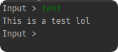

# JCommand

A command library for java


## Maven Installation

```java

<repository>
  <id>reposilite-repository</id>
  <name>Seby's Project Repository</name>
  <url>http://mcsilent.de:8091/{repository}</url>
</repository>

<dependency>
  <groupId>com.github.sebyplays</groupId>
  <artifactId>JCommand</artifactId>
  <version>1.0-SNAPSHOT</version>
</dependency>
```

## Used libraries

- [lombok](https://projectlombok.org/)

## Usage/Examples
```java
import com.github.sebyplays.jcommand.utils.Command;

public class CommandTest {

    public static void main(String[] args) {
        //create a JCommand instance:
        JCommand jCommand = new JCommand();

        //register a command (commandName, description, executor):
        jCommand.registerCommand("test", "this is a test command", new CommandExecutor() {
            @Override
            public boolean onCommand(CommandSender commandSender, Command command, String[] args) {
                System.out.println("This is a test lol");
                return false;
            }
        });

    }

}
```

Output:


